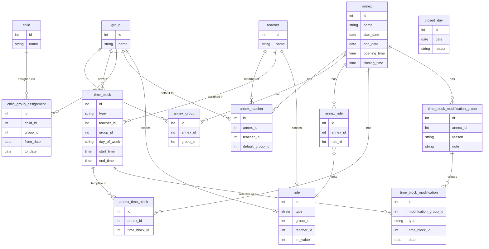

# CLAUDE.md

This file provides guidance to Claude Code when working with code in this repository.

---

## Project Overview

A **Preschool Teacher Scheduling Application** for a director to manage teacher assignments across children's groups. Deployable as a web app or standalone Electron desktop app (with embedded backend).

---

## Tech Stack

| Layer         | Technology                                      |
|---------------|-------------------------------------------------|
| Frontend      | React (TypeScript)                              |
| Backend       | Spring Boot (Java)                              |
| Database      | PostgreSQL (web) / H2 embedded (Electron)       |
| Desktop       | Electron (Spring Boot embedded as subprocess)   |
| Build tools   | Maven (backend), Vite + npm (frontend)          |
| Formatting    | Prettier (frontend)                             |
| DB Migrations | Liquibase                                       |

### Frontend Stack

| Concern        | Choice                          |
|----------------|---------------------------------|
| Styling        | Tailwind CSS                    |
| Components     | shadcn/ui (Radix UI primitives) |
| Data fetching  | Redux Toolkit + RTK Query       |
| Routing        | React Router                    |

### Frontend UI Design

| Decision       | Choice                                                                 |
|----------------|------------------------------------------------------------------------|
| Navigation     | Collapsible left sidebar (icon-only on tablet)                         |
| Primary view   | Group view — time-axis calendar (Y = time, X = Mon–Fri), teacher blocks colour-coded per teacher |
| Secondary view | Teacher view — same layout, group blocks colour-coded per group        |
| Visual style   | Clean, light background, richly colour-coded blocks                    |
| CRUD screens   | Full pages navigated via sidebar                                       |
| Responsive     | Sidebar collapses on tablet; calendar grid scrolls horizontally        |
| Modifications  | Visually distinct from template blocks (e.g. dashed border)           |

---

## Architecture

```
planner/
├── backend/        # Spring Boot (Java) REST API
├── frontend/       # React (TypeScript) SPA
└── electron/       # Electron shell, spawns backend subprocess
```

- The frontend communicates with the backend via REST API.
- In Electron mode, the backend JAR is bundled and spawned as a local subprocess on startup.
- No authentication is required (director-only, single-user).

---

## Domain Model

### Core Entities

- **Teacher** — global identity record (name). Annex-specific attributes (default group) live in `AnnexTeacher`. Monthly hour requirements are defined via `Rule`.
- **Group** — global identity record (name). Membership per annex is tracked via `AnnexGroup`.
- **Child** — basic record (name). Group membership over time is tracked via `ChildGroupAssignment`.
- **ChildGroupAssignment** — tracks which group a child belongs to over time (`from_date`, `to_date`). Allows moving a child between groups without creating a new annex. The active assignment is the row where `to_date` is null.
- **Annex** — top-level organizational period. Holds operating hours (`opening_time`, `closing_time`) and owns all plans, rules, and memberships.
- **AnnexTeacher** — scopes a teacher to an annex with annex-specific attributes: `default_group`.
- **AnnexGroup** — scopes a group to an annex. Preserves history when groups are added or dissolved between annexes.
- **Rule** — a generic configurable rule with a `type`, optional `group_id`, optional `teacher_id`, and an `int_value`. Supported types (`RuleType` enum):
  - `TEACHER_WEEKLY_HOURS_MIN` — teacher must work at least X hours/week (uses `teacher_id`)
  - `TEACHER_MAX_HOURS_PER_DAY` — teacher must not exceed X hours/day (uses `teacher_id`)
  - `GROUP_MIN_TEACHERS` — group must have at least X teachers at all times (uses `group_id`)
  - `GROUP_MAX_TEACHERS` — group must have at most X teachers at all times (uses `group_id`)
- **AnnexRule** — links a `Rule` to an `Annex`, allowing each annex to have its own set of rules.
- **TimeBlock** — a reusable block definition: teacher, group, day of week, start and end time. `type` is either `TEMPLATE` (part of the standard week, linked via `AnnexTimeBlock`) or `MODIFICATION` (a one-off block used by an ADD modification).
- **AnnexTimeBlock** — links a `TEMPLATE` `TimeBlock` to an annex, forming the standard weekly schedule.
- **TimeBlockModificationGroup** — groups related modifications together (e.g. the two sides of an exchange). Has a `reason` (TIME_OFF, EXCHANGE, OTHER) and a `note`.
- **TimeBlockModification** — a single ADD or REMOVE operation on a specific date, referencing a `TimeBlock`:
  - **REMOVE**: references a `TEMPLATE` `TimeBlock` + date to cancel that block's occurrence for that week.
  - **ADD**: references a `MODIFICATION` `TimeBlock` + date to introduce a new block on that date.
- **ClosedDay** — marks a specific date as a preschool closure (e.g. public holiday). The schedule computation skips any date found here. No `annex_id` needed — the date implicitly falls within the correct annex by its date range.

### Key Rules

- A teacher normally covers one group for the full week.
- A teacher may split hours across multiple groups within a single day, as long as all staffing rules are satisfied.
- Each group must meet its minimum teacher coverage at all times.
- Teacher weekly hour requirements are defined via `TEACHER_WEEKLY_HOURS_MIN` rules linked to the annex.

---

## Key Features

### 1. Plan Management
- Manage Annexes as top-level periods (with operating hours, teacher/group memberships, and rules).
- Define `TEMPLATE` `TimeBlock` rows linked via `AnnexTimeBlock` to represent the standard week for an annex.
- The effective schedule for any given week is computed by taking the template blocks and applying all `TimeBlockModification` records that fall within that week.
- Director creates modifications (ADD/REMOVE) grouped under a `TimeBlockModificationGroup` with a reason (TIME_OFF, EXCHANGE, OTHER). No separate weekly plan entity exists — all scheduling is managed at the annex level.

### 2. Weekly Overview
- Grid view: columns = days of the week, rows = teachers (or time axis), cells = group assignments with start/end hours.
- Color-coded per group and per teacher.
- No predefined time slots — hours are flexible and entered freely.

### 3. Teacher & Group Schedule Views
- Filter the weekly view by a specific teacher or group.

### 4. Manual Replacement & Exchange
- Director creates a `TimeBlockModificationGroup` (reason: TIME_OFF or EXCHANGE) with ADD/REMOVE modification records.
- An exchange is two REMOVE + two ADD modifications in the same group.
- A time-off is one REMOVE + one ADD (replacement) in the same group.
- The system validates the resulting schedule against all rules and surfaces any violations.
- Automatic replacement search is **out of scope** for now (planned for a future version).

### 5. Validation Dashboard
- Two validation modes:
  - **Date-based** (`GET /api/annexes/{id}/violations?year=&month=`): checks the effective schedule (template + modifications) for a real calendar month against working days (Mon–Fri, excluding closed days).
  - **Template-based** (`GET /api/annexes/{id}/violations/template`): checks the template schedule against day-of-week patterns (no real dates). Used in the Plan Table view.
- Violation types (`ViolationType` enum): `TEACHER_WEEKLY_HOURS_TOO_LOW`, `TEACHER_DAILY_HOURS_TOO_HIGH`, `GROUP_TEACHER_COUNT_TOO_LOW`, `GROUP_TEACHER_COUNT_TOO_HIGH`.
- All template violations are severity `ERROR`. Date-based violations use `ERROR`/`WARNING`.

### 6. CRUD Management Views
- Create/edit/delete Annexes (with operating hours).
- Create/edit/delete teachers and manage their annex memberships (default group).
- Create/edit/delete groups and manage their annex memberships.
- Manage children and their group assignments (via `ChildGroupAssignment`).
- Manage rules and link them to annexes.
- Manage template time blocks (standard week) per annex.

---

## Database Schema



---

## Frontend Structure

### Routing (`frontend/src/App.tsx`)

```
AppLayout (sidebar + outlet)
├── /schedule/groups          → GroupSchedulePage     (read-only calendar, filter by group)
├── /schedule/teachers        → TeacherSchedulePage   (read-only calendar, filter by teacher)
├── /annexes                  → AnnexesPage           (CRUD table for all annexes)
├── /teachers                 → TeachersPage
├── /groups                   → GroupsPage
├── /rules                    → RulesPage
├── /closed-days              → ClosedDaysPage
└── /annexes/:id              → AnnexLayout           (tabs header + outlet)
    ├── settings              → AnnexSettingsPage
    ├── teachers              → AnnexTeachersPage
    ├── groups                → AnnexGroupsPage
    ├── rules                 → AnnexRulesPage
    ├── plan/groups           → AnnexPlanGroupPage     (draft planner by group)
    ├── plan/teachers         → AnnexPlanTeacherPage   (draft planner by teacher)
    ├── plan/overview         → AnnexPlanOverviewPage  (full-day overview planner)
    └── plan/table            → AnnexPlanTablePage     (tabular view with violations)
```

### Layout Components

- **`AppLayout`** (`components/layout/AppLayout.tsx`) — flex container: `Sidebar` + `<Outlet>`
- **`Sidebar`** (`components/layout/Sidebar.tsx`) — collapsible (56px / 224px). Three sections: Schedule, Management, Draft Annex. The Draft Annex section dynamically finds the one DRAFT-state annex via `useGetAnnexesQuery` and builds its links from `base = /annexes/{draftId}`.
- **`AnnexLayout`** (`components/layout/AnnexLayout.tsx`) — loads annex by `:id` param, renders a tab bar (8 tabs), passes `annex` object to child pages via `<Outlet context={annex}>`. Children access it with `useOutletContext<AnnexDto>()`.

### Schedule / Calendar Components (`frontend/src/components/schedule/`)

| File | Purpose |
|------|---------|
| `CalendarGrid.tsx` | Read-only calendar. Props: `blocks`, `annex`, `weekDays`, `colorBy`. X=days, Y=time (06:00–20:00, 48px/hr). Uses `assignColumns()` for overlap layout. |
| `DraftCalendarGrid.tsx` | Interactive version of CalendarGrid. Supports `xAxis="days"` (Mon–Fri) or `xAxis="groups"` (group columns). Drop zones (HTML5 DnD), resize handles (top/bottom, document mousemove), hover-X delete. Editing disabled when `editable=false`. |
| `TimeBlock.tsx` | Read-only block renderer used by CalendarGrid. |
| `ScheduleHeader.tsx` | Annex selector + filter dropdown + week navigation. Used by read-only schedule pages. |
| `types.ts` | `AnnexDto`, `ScheduleBlock`, `AnnexGroupDto`, `AnnexTeacherDto`, `DayOfWeek` |
| `utils.ts` | `timeToMinutes`, `minutesToTime`, `timeToTop`, `blockHeight`, `totalGridHeight`, `hoursRange`, `HOUR_HEIGHT_PX=48`, `WEEK_DAYS`, `getWeekStart`, `getWeekDays`, `addWeeks` |
| `colors.ts` | `getColorForId(id)` → 8-color palette (bg/border/text) cycling by `id % 8` |

### Plan Pages (Draft Annex Planner)

All three pages: get `annex` from `useOutletContext<AnnexDto>()`, set `editable = annex.state === 'DRAFT'`.

**`AnnexPlanGroupPage`** — Select a group (dropdown). Right panel: draggable teacher list. Calendar (`xAxis="days"`): shows blocks filtered by selected group. Drop a teacher → creates `TEMPLATE` block spanning the full annex schedule day (start/end from `annex.scheduleStartTime`/`scheduleEndTime`).

**`AnnexPlanTeacherPage`** — Mirror of above. Select a teacher. Right panel: draggable group list. Drop a group → creates full-day block.

**`AnnexPlanOverviewPage`** — Day/Week toggle. Day mode: `xAxis="groups"` (each group = column for selected day), drop teacher on group column. Week mode: `xAxis="days"` showing all blocks, editing only (no DnD creation). Day navigation: prev/next + day tabs.

**`AnnexPlanTablePage`** (`pages/annex/AnnexPlanTablePage.tsx`) — Tabular plan view. Layout: `flex flex-col h-full` with three zones:
1. **Table area** (scrollable, `flex-1`): columns = Group | Teacher | Mon–Fri | Hours | Overhours. One row per (group, teacher) pair; group cell spans all its teacher rows via `rowSpan`. Teachers sorted by earliest block start time within the group.
   - **Teacher cell**: bold + normal color when `teacher.defaultGroupId === group.groupId`; muted otherwise. Custom tooltip follows mouse showing assignment status.
   - **Day cells**: use `HorizontalTimeCell` component — proportional horizontal bars for each block. Drag-and-drop teacher from right panel to create a new full-day block. Click a block to open an edit modal (start/end time, delete).
   - **Hours cell**: total hours for that teacher in that group only across all days.
   - **Overhours cell**: if teacher's default group matches this row → shows `actual − minWeekly` (red if negative); otherwise → shows `+Xh` for all hours in this group (none = `—`).
2. **Right panel** (collapsible, resizable by dragging left edge, min 160 / max 520): color-coded teacher chips (`getColorForId`) draggable onto day cells.
3. **Bottom violations panel** (resizable by dragging top edge, default 420px, max = container height − 80): shows `TemplateViolationDto[]` from `GET /annexes/{id}/violations/template`. All displayed as errors. Toggle to collapse to header bar.

Export button calls `exportPlanTableToExcel(annexName, rows, allBlocks, rules, labels)` — landscape A4 xlsx via ExcelJS. Teacher/day cells are color-coded; group column merged across teacher rows; overhours column bold for default-group rows, red for negative values. `labels` is built from `t()` calls so column headers respect the active language.

`HorizontalTimeCell` (`components/schedule/HorizontalTimeCell.tsx`) — renders blocks as proportional horizontal bars within a table cell, proportional to the annex schedule window. Supports resize handles and delete on hover.

### Rules Organization

Rules have a three-level priority resolved by `RuleResolutionService`:

1. **Annex-specific, entity-scoped** — `AnnexRule` linking an annex to a `Rule` that has a `teacher_id` or `group_id` set.
2. **Annex default** — `AnnexRule` linking an annex to a `Rule` with no `teacher_id`/`group_id` (applies to all teachers or groups in that annex).
3. **Global default** — a `Rule` with no `AnnexRule` entry and no `teacher_id`/`group_id` (applies everywhere unless overridden).

`RuleWithSourceDto` (Java record, also mirrored in `frontend/src/types.ts`) carries: `ruleId`, `annexRuleId` (null if global), `annexId`, `annexName`, `ruleType`, `teacherId`, `groupId`, `intValue`. The frontend uses `annexRuleId === null` to distinguish global from annex-scoped rules.

Frontend resolution helper `effectiveMinHours(rules, teacherId)` in both `AnnexPlanTablePage` and `exportPlanTable.ts` replicates the same priority order in order to compute overhours display without an extra API call.

`useGetAnnexRulesCombinedQuery(annexId)` → `RuleWithSourceDto[]` returns all rules visible to that annex (annex-specific + global) in one endpoint.

### RTK Query API (`frontend/src/store/annexesApi.ts`)

All queries/mutations are injected into the base `api` (`store/api.ts`, `baseUrl: '/api'`). Key hooks:

```
useGetAnnexesQuery()
useGetAnnexGroupsQuery(annexId)          → AnnexGroupDto[]       {id, annexId, groupId, groupName}
useGetAnnexTeachersQuery(annexId)        → AnnexTeacherDto[]     {id, annexId, teacherId, firstName, lastName, defaultGroupId, defaultGroupName}
useGetAnnexTimeBlocksQuery(annexId)      → ScheduleBlock[]
useGetAnnexRulesCombinedQuery(annexId)   → RuleWithSourceDto[]   all rules visible to this annex (annex + global)
useCreateAnnexTimeBlockMutation()        → POST   /annexes/{id}/time-blocks
useUpdateAnnexTimeBlockMutation()        → PUT    /annexes/{id}/time-blocks/{annexTimeBlockId}  (startTime, endTime only)
useDeleteAnnexTimeBlockMutation()        → DELETE /annexes/{id}/time-blocks/{annexTimeBlockId}

// from store/violationsApi.ts
useGetViolationsQuery({annexId, year, month})  → ViolationDto[]          GET /annexes/{id}/violations?year=&month=
useGetTemplateViolationsQuery(annexId)         → TemplateViolationDto[]  GET /annexes/{id}/violations/template
```

Tags: `Annex`, `AnnexGroup`, `AnnexTeacher`, `AnnexTimeBlock`, `AnnexRule`, `Teacher`, `Group`, `ClosedDay`, `Violation`.

---

## Draft Annex Concept

A **Draft Annex** is an annex with `state = 'DRAFT'`. It represents the next period being planned before it goes live.

- Only **one DRAFT** annex can exist at a time (enforced by backend `AnnexService`).
- Activating a DRAFT (`POST /api/annexes/{id}/activate`) transitions it to `CURRENT` and archives the previous `CURRENT` as `FINISHED`.
- The sidebar "Draft Annex" section always points to the single DRAFT annex. If none exists, links go to `/annexes`.
- **DRAFT** annexes are fully editable (template blocks, teachers, groups, rules, settings).
- **CURRENT** annexes: settings/memberships can be edited but the warning banner is shown; plan pages display but editing is disabled.
- **FINISHED** annexes: read-only everywhere.

### Template Schedule (AnnexTimeBlock)

The draft annex's weekly schedule is built from `TEMPLATE` `TimeBlock` records linked via `AnnexTimeBlock`. These blocks have `dayOfWeek` (no specific date). The effective schedule for a given real-world week = template blocks + any `TimeBlockModification` records for that date range.

- `TimeBlock` entity: `{type, teacherId, groupId, dayOfWeek, startTime, endTime}`
- `AnnexTimeBlock` entity: `{annexId, timeBlockId}` — join between annex and time block
- Frontend DTO: `ScheduleBlock` — flattened view with teacher/group names included

---

## Backend Structure

```
backend/src/main/java/com/planner/
├── controller/
│   ├── AnnexController.java
│   ├── AnnexTimeBlockController.java     GET/POST/PUT/DELETE /api/annexes/{id}/time-blocks
│   ├── AnnexTeacherController.java
│   ├── AnnexGroupController.java
│   ├── ViolationController.java          GET /api/annexes/{id}/violations  and  /violations/template
│   ├── TeacherController.java
│   └── GroupController.java
├── service/
│   ├── AnnexService.java                 enforces one-DRAFT rule, handles activation
│   ├── AnnexTimeBlockService.java        create/update/delete TimeBlock + AnnexTimeBlock
│   ├── AnnexMembershipService.java       teacher/group assignments to annexes
│   ├── ViolationService.java             findViolations() (date-based) + findTemplateViolations() (template)
│   └── RuleResolutionService.java        resolveForTeacher() / resolveForGroup() with 3-level priority
├── entity/                               JPA entities (Annex, TimeBlock, AnnexTimeBlock, Rule, RuleType, ViolationType, …)
├── dto/                                  Records (AnnexDto, RuleWithSourceDto, ViolationDto, TemplateViolationDto, …)
└── repository/                           Spring Data JPA repos
```

---

## Build & Run Commands

> To be filled in as the project is built out.

```bash
# Backend
cd backend
./mvnw spring-boot:run

# Frontend
cd frontend
npm install
npm run dev

# Electron
cd electron
npm install
npm run start
```

---

## Development Notes

- Frontend code is formatted with Prettier. Run `npm run format` before committing.
- All schedule validation logic lives in the backend as a service, not in the frontend.
- Automatic replacement search is out of scope; the system only validates manually constructed replacements.
- Liquibase manages all database schema changes via changelog files in the backend.
- H2 in-memory/file mode is used for Electron builds; PostgreSQL for web deployment.
- The frontend should be a single-page application that proxies API calls to `localhost:{port}` in Electron mode.
