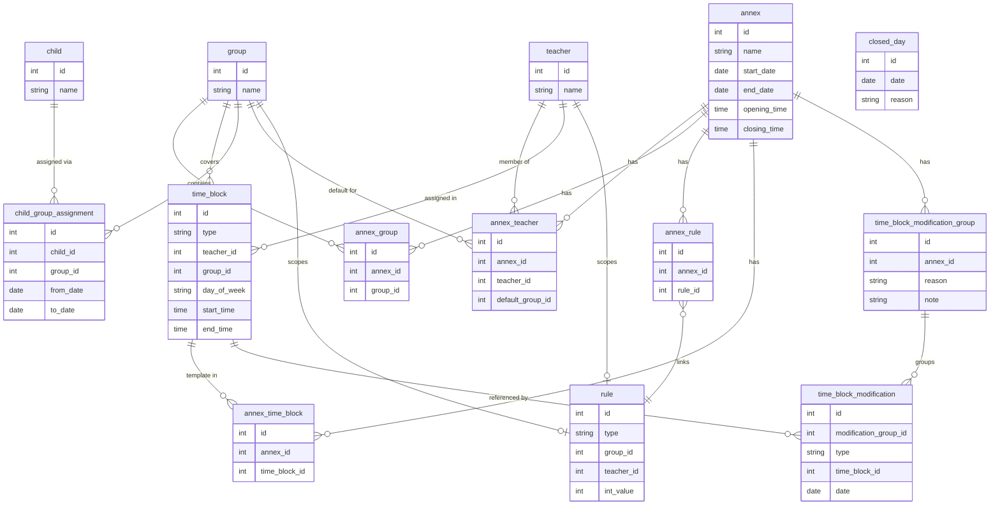

# CLAUDE.md

This file provides guidance to Claude Code when working with code in this repository.

---

## Project Overview

A **Preschool Teacher Scheduling Application** for a director to manage teacher assignments across children's groups. Deployable as a web app or standalone Electron desktop app (with embedded backend).

---

## Tech Stack

| Layer         | Technology                                      |
|---------------|-------------------------------------------------|
| Frontend      | React (TypeScript)                              |
| Backend       | Spring Boot (Java)                              |
| Database      | PostgreSQL (web) / H2 embedded (Electron)       |
| Desktop       | Electron (Spring Boot embedded as subprocess)   |
| Build tools   | Maven (backend), Vite + npm (frontend)          |
| Formatting    | Prettier (frontend)                             |
| DB Migrations | Liquibase                                       |

### Frontend Stack

| Concern        | Choice                          |
|----------------|---------------------------------|
| Styling        | Tailwind CSS                    |
| Components     | shadcn/ui (Radix UI primitives) |
| Data fetching  | Redux Toolkit + RTK Query       |
| Routing        | React Router                    |

### Frontend UI Design

| Decision       | Choice                                                                 |
|----------------|------------------------------------------------------------------------|
| Navigation     | Collapsible left sidebar (icon-only on tablet)                         |
| Primary view   | Group view — time-axis calendar (Y = time, X = Mon–Fri), teacher blocks colour-coded per teacher |
| Secondary view | Teacher view — same layout, group blocks colour-coded per group        |
| Visual style   | Clean, light background, richly colour-coded blocks                    |
| CRUD screens   | Full pages navigated via sidebar                                       |
| Responsive     | Sidebar collapses on tablet; calendar grid scrolls horizontally        |
| Modifications  | Visually distinct from template blocks (e.g. dashed border)           |

---

## Architecture

```
planner/
├── backend/        # Spring Boot (Java) REST API
├── frontend/       # React (TypeScript) SPA
└── electron/       # Electron shell, spawns backend subprocess
```

- The frontend communicates with the backend via REST API.
- In Electron mode, the backend JAR is bundled and spawned as a local subprocess on startup.
- No authentication is required (director-only, single-user).

---

## Domain Model

### Core Entities

- **Teacher** — global identity record (name). Annex-specific attributes (default group) live in `AnnexTeacher`. Monthly hour requirements are defined via `Rule`.
- **Group** — global identity record (name). Membership per annex is tracked via `AnnexGroup`.
- **Child** — basic record (name). Group membership over time is tracked via `ChildGroupAssignment`.
- **ChildGroupAssignment** — tracks which group a child belongs to over time (`from_date`, `to_date`). Allows moving a child between groups without creating a new annex. The active assignment is the row where `to_date` is null.
- **Annex** — top-level organizational period. Holds operating hours (`opening_time`, `closing_time`) and owns all plans, rules, and memberships.
- **AnnexTeacher** — scopes a teacher to an annex with annex-specific attributes: `default_group`.
- **AnnexGroup** — scopes a group to an annex. Preserves history when groups are added or dissolved between annexes.
- **Rule** — a generic configurable rule with a `type`, optional `group_id`, optional `teacher_id`, and an `int_value`. Supported types:
  - `TEACHER_MONTHLY_HOURS_MIN` — teacher must work at least X hours/month (uses `teacher_id`)
  - `TEACHER_MAX_HOURS_PER_DAY` — teacher must not exceed X hours/day (uses `teacher_id`)
  - `GROUP_MIN_TEACHERS` — group must have at least X teachers at all times (uses `group_id`)
  - `TEACHER_MAX_FREE_HOURS_MONTHLY` — teacher may have at most X free hours/month (uses `teacher_id`)
- **AnnexRule** — links a `Rule` to an `Annex`, allowing each annex to have its own set of rules.
- **TimeBlock** — a reusable block definition: teacher, group, day of week, start and end time. `type` is either `TEMPLATE` (part of the standard week, linked via `AnnexTimeBlock`) or `MODIFICATION` (a one-off block used by an ADD modification).
- **AnnexTimeBlock** — links a `TEMPLATE` `TimeBlock` to an annex, forming the standard weekly schedule.
- **TimeBlockModificationGroup** — groups related modifications together (e.g. the two sides of an exchange). Has a `reason` (TIME_OFF, EXCHANGE, OTHER) and a `note`.
- **TimeBlockModification** — a single ADD or REMOVE operation on a specific date, referencing a `TimeBlock`:
  - **REMOVE**: references a `TEMPLATE` `TimeBlock` + date to cancel that block's occurrence for that week.
  - **ADD**: references a `MODIFICATION` `TimeBlock` + date to introduce a new block on that date.
- **ClosedDay** — marks a specific date as a preschool closure (e.g. public holiday). The schedule computation skips any date found here. No `annex_id` needed — the date implicitly falls within the correct annex by its date range.

### Key Rules

- A teacher normally covers one group for the full week.
- A teacher may split hours across multiple groups within a single day, as long as all staffing rules are satisfied.
- Each group must meet its minimum teacher coverage at all times.
- Teacher monthly hour requirements are defined via `TEACHER_MONTHLY_HOURS_MIN` rules linked to the annex.

---

## Key Features

### 1. Plan Management
- Manage Annexes as top-level periods (with operating hours, teacher/group memberships, and rules).
- Define `TEMPLATE` `TimeBlock` rows linked via `AnnexTimeBlock` to represent the standard week for an annex.
- The effective schedule for any given week is computed by taking the template blocks and applying all `TimeBlockModification` records that fall within that week.
- Director creates modifications (ADD/REMOVE) grouped under a `TimeBlockModificationGroup` with a reason (TIME_OFF, EXCHANGE, OTHER). No separate weekly plan entity exists — all scheduling is managed at the annex level.

### 2. Weekly Overview
- Grid view: columns = days of the week, rows = teachers (or time axis), cells = group assignments with start/end hours.
- Color-coded per group and per teacher.
- No predefined time slots — hours are flexible and entered freely.

### 3. Teacher & Group Schedule Views
- Filter the weekly view by a specific teacher or group.

### 4. Manual Replacement & Exchange
- Director creates a `TimeBlockModificationGroup` (reason: TIME_OFF or EXCHANGE) with ADD/REMOVE modification records.
- An exchange is two REMOVE + two ADD modifications in the same group.
- A time-off is one REMOVE + one ADD (replacement) in the same group.
- The system validates the resulting schedule against all rules and surfaces any violations.
- Automatic replacement search is **out of scope** for now (planned for a future version).

### 5. Validation Dashboard
- Runs against the computed schedule for a given week and surfaces errors/warnings such as:
  - A group has no teacher assigned for a time slot.
  - A teacher has unassigned hours (total scheduled for month < `TEACHER_MONTHLY_HOURS_MIN` rule value).
  - A teacher is double-booked.
  - A group is below minimum staffing threshold.

### 6. CRUD Management Views
- Create/edit/delete Annexes (with operating hours).
- Create/edit/delete teachers and manage their annex memberships (default group).
- Create/edit/delete groups and manage their annex memberships.
- Manage children and their group assignments (via `ChildGroupAssignment`).
- Manage rules and link them to annexes.
- Manage template time blocks (standard week) per annex.

---

## Database Schema



---

## Build & Run Commands

> To be filled in as the project is built out.

```bash
# Backend
cd backend
./mvnw spring-boot:run

# Frontend
cd frontend
npm install
npm run dev

# Electron
cd electron
npm install
npm run start
```

---

## Development Notes

- Frontend code is formatted with Prettier. Run `npm run format` before committing.
- All schedule validation logic lives in the backend as a service, not in the frontend.
- Automatic replacement search is out of scope; the system only validates manually constructed replacements.
- Liquibase manages all database schema changes via changelog files in the backend.
- H2 in-memory/file mode is used for Electron builds; PostgreSQL for web deployment.
- The frontend should be a single-page application that proxies API calls to `localhost:{port}` in Electron mode.
